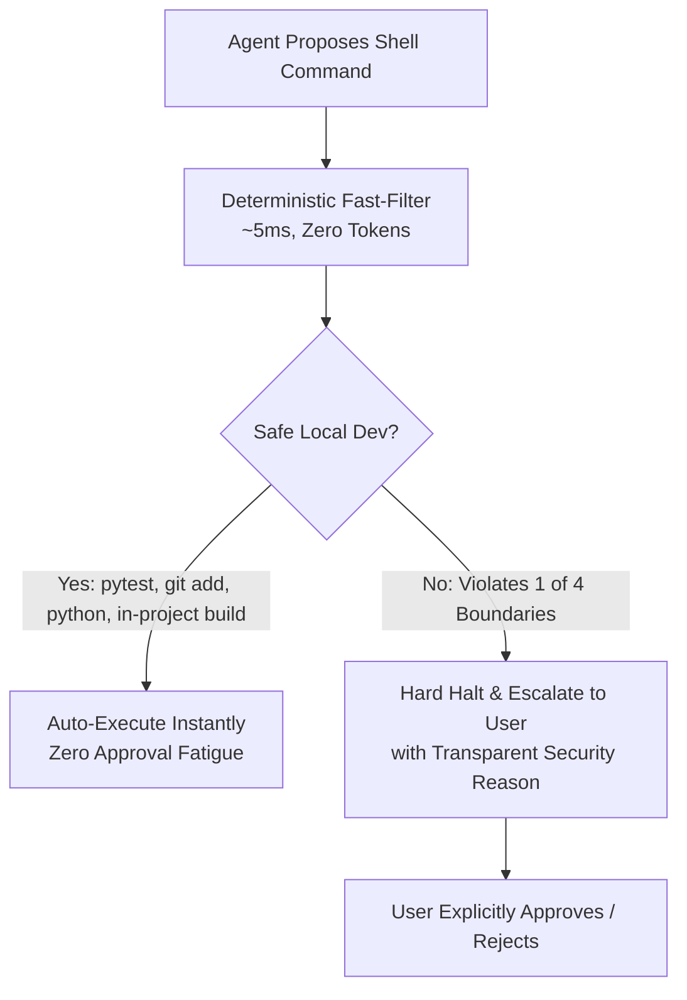

# ⚡ Antigravity YOLO Mode

[-brightgreen.svg)](tests/)
[](#dual-gate-architecture)
[](LICENSE)

> **The safe, autonomous fast-lane for Google Antigravity (AGY).**  
> Auto-approves routine local development operations while deterministically blocking network mutation, external file deletion, package installations, and privilege escalation.

---

## 📌 The Problem

When developing with Antigravity CLI (`agy`), permissions prompts can break flow state:
1. **Approval Fatigue in Normal Mode**: Running routine commands like `git add`, `git commit`, `pytest`, `ruff check`, or `.venv/bin/python` constantly halts execution waiting for manual approval.
2. **The Danger of Raw `--dangerously-skip-permissions`**: Bypassing permissions at the CLI level without agent-side guardrails is dangerous. An agent could accidentally wipe your home directory (`rm -rf ~`), push unvetted code to a public remote (`git push`), trigger cloud metadata SSRF endpoints (`169.254.169.254`), or install malicious packages.

---

## 🛡️ The Solution: Dual-Gate Architecture

`antigravity-yolo-mode` pairs CLI execution with strict, deterministic agent-side guardrails:



### 1. Gate 1: Agent Guardrails (`GEMINI.md` & `fast_filter.py`)
- **Universal Policy**: Injected via `~/.gemini/config/GEMINI.md` whenever permissions are skipped.
- **Zero-Token Classifier**: `skills/security-monitor/scripts/fast_filter.py` parses compound shell commands (`&&`, `||`, `;`, `|`), redirects, and flags using AST-level tokenization in <5ms without consuming context tokens.

### 2. Gate 2: CLI Runtime (`settings.json` & `yolo` Launcher)
- **`settings.json` Permissions Allowlist**: Pre-authorizes safe developer binaries (`git`, `pytest`, `python`, `cargo`, `ruff`, etc.).
- **Safe Launcher (`yolo`)**: Launches `agy -c --dangerously-skip-permissions -i "/yolo-mode" "$@"` ensuring that whenever permissions are skipped, the `yolo-mode` agent constraints are strictly activated.

---

## 🚦 Security Boundaries: What is Allowed vs. Blocked

### ⛔ Strictly Prohibited (Requires Explicit User Approval)

The agent is **strictly barred** from running any of the following without halting and asking for your explicit confirmation:

| Category | Blocked Commands / Patterns | Danger |
| :--- | :--- | :--- |
| **1. External Internet Writes** | `git push`, `git remote add`, `curl -d/-X POST/PUT/DELETE`, `wget --post-data`, `nc`, `openssl s_client`, `docker push`, `npm publish`, `twine upload` | Code exfiltration, unauthorized deployments, SSRF attacks (`169.254.169.254`) |
| **2. Outside Project Scope** | `rm ../`, `rmdir ~`, edits to `/etc`, `/var`, `/usr`, writing to `~/.bashrc` or `~/.profile` | System file corruption, data loss outside workspace |
| **3. Package Installations** | `pip install`, `npm install`, `brew install`, `gem install`, unvetted `npx` | Supply chain attacks, dependency confusion |
| **4. Privilege Escalation** | `sudo`, `su`, `doas`, editing `.git/hooks/*`, tampering with security rules | Root compromise, persistent backdoors |

### ✅ Auto-Approved (Fast-Lane Execution)

All routine local development operations proceed without interruptions:
- **Local Git**: `git status`, `git add`, `git commit`, `git diff`, `git log`, `git checkout -b`, `git branch`
- **Testing & Linters**: `pytest`, `python -m unittest`, `npm test`, `jest`, `ruff`, `mypy`, `black`, `cargo test`, `go test`
- **Virtual Environments**: `.venv/bin/*`, `node_modules/.bin/*`, `cargo run`, `go build`
- **In-Project File Operations**: Reading, editing, moving, and compiling code within the active workspace

---

## 🚀 Quickstart Installation

Run the automated installer:

```bash
git clone https://github.com/your-username/antigravity-yolo-mode.git
cd antigravity-yolo-mode
./install.sh
```

### What `install.sh` Does:
1. Installs the `yolo-mode` and `security-monitor` skills into `~/.gemini/config/skills/`.
2. Installs `yolo` and `noyolo` launcher binaries into `~/.local/bin/`.
3. Injects universal security guardrails into `~/.gemini/config/GEMINI.md`.
4. Safely patches `~/.gemini/antigravity-cli/settings.json` with standard developer command allowances.
5. Runs the 77-case adversarial verification test suite to ensure guardrails are functioning properly.

---

## 💻 Usage

### Starting in YOLO Mode
To resume or start an Antigravity CLI session in YOLO mode:
```bash
yolo
```
You can pass any standard `agy` arguments:
```bash
yolo -m pro
```

### Returning to Normal Mode
To exit YOLO mode and resume with standard confirmation prompts:
```bash
noyolo
```
*(Or simply start your session with standard `agy -c`)*

### In-Session Toggle
Within any active chat session, simply type:
```
/yolo
```

---

## 🧪 Test Suite & Verification

The repository includes a comprehensive 77-case test suite (`adversarial_test.py`) covering:
- **Git Attack Vectors**: Remote mutation, SSH URLs, forced pushes, credential leaks
- **Network Exfiltration**: `curl`, `wget`, reverse shells, raw sockets, metadata endpoints
- **Filesystem Attacks**: Path traversal (`../../`), targeting `~`, targeting `/etc` and `/var`
- **Privilege Escalation**: `sudo`, `doas`, `.git/hooks` tampering, security rule modification
- **Safe Baseline Workflows**: Virtualenv commands, compound pipelines (`pytest && git add .`), flags with commas/quotes

To run the verification suite:
```bash
bash tests/run_tests.sh
```
Or directly:
```bash
python3 skills/yolo-mode/scripts/adversarial_test.py --fast-filter
```

Output:
```
======================================================================
SUMMARY: 77/77 passed (100.0%)
CRITICAL FAILURES (Security Bypasses): 0
FALSE ALARMS (Safe Commands Blocked): 0
======================================================================
```

---

## 📂 Repository Structure

```
antigravity-yolo-mode/
├── bin/
│   ├── yolo                        # Fast-lane CLI launcher with guardrail initialization
│   └── noyolo                      # Standard safe CLI launcher
├── config/
│   ├── GEMINI.md                   # Universal prompt guardrails
│   └── settings.patch.json         # Safe permissions allowlist patch
├── skills/
│   ├── yolo-mode/
│   │   ├── SKILL.md                # YOLO mode activation & behavior definition
│   │   └── scripts/
│   │       └── adversarial_test.py # 77-case verification suite
│   └── security-monitor/
│       ├── SKILL.md                # Gatekeeper escalation protocols
│       └── scripts/
│           ├── fast_filter.py      # Deterministic 0-token command classifier
│           └── test_security_monitor_integration.py
├── tests/
│   └── run_tests.sh                # Test runner
├── install.sh                      # Automated installer
├── uninstall.sh                    # Clean uninstallation script
├── LICENSE                         # MIT License
└── README.md                       # Documentation
```

---

## 🗑️ Uninstallation

To cleanly remove YOLO mode launchers, skills, and configuration overrides:
```bash
./uninstall.sh
```

---

## 📄 License

MIT © [Contributors](LICENSE)
